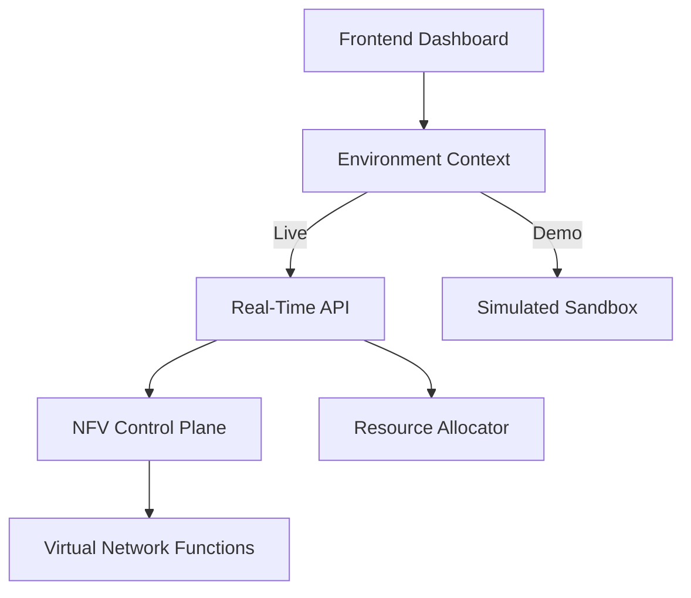

# ⚛️ Atomic Platform: Next-Gen NFV Orchestration

[](.)
[](.)
[](.)
[](https://github.com/Ramius-arch)

> **Precision Control and Real-time Visualization for the Virtualized Network Edge.**

Atomic is a high-performance **Network Function Virtualization (NFV) Orchestration Tool** designed for the modern telecom landscape. It bridges the gap between complex bare-metal infrastructure and agile, cloud-native virtualization, providing operators with a unified command center for deployment, monitoring, and scaling.

---

## 🚀 Core Value Proposition

Atomic simplifies the lifecycle management of Virtual Network Functions (VNFs) by providing a **single pane of glass** for:
- **Dynamic Provisioning**: Rapid allocation of compute and memory assets.
- **Topology Intelligence**: Live, interactive mapping of cross-domain infrastructure.
- **Unified Telemetry**: High-resolution performance tracking and predictive monitoring.
- **Hybrid Control**: Seamlessly bridging modern SDN flows with legacy CLI-based hardware.

---

## ✨ Key Features

### 🛠️ Strategic Orchestration
- **Control Plane Manager**: Push silicon-level configurations and query real-time sensor states.
- **Data Plane Flow-Bridge**: Inject SDN flow-rules across switches with sub-second latency.
- **Resource Inventory**: Lease and scale physical assets dynamically via a managed registry.

### 📊 Tactical Awareness
- **Telemetry Stream**: Real-time visualization of CPU, Memory, and Network throughput.
- **Interactive Topology**: A fully interactive, graph-based map of the network mesh.
- **Collapsible Dashboards**: Information-dense yet clean layouts optimized for operational focus.

### 🧪 Dual-Mode Environment
- **Live Mode**: Direct infrastructure manipulation for production-grade orchestration.
- **Demo Sandbox**: A fully-functional simulation mode with mock data and visual indicators—perfect for training, testing, and system walkthroughs.

---

## 🧬 System Architecture

Atomic uses a modular **Multi-Page Architecture** built for reliability and scale:



---

## 🛠️ Tech Stack

| Layer | Technologies |
| :--- | :--- |
| **Frontend** | React 19, TypeScript, **Tailwind CSS**, Vite |
| **Data Viz** | **XYFlow** (Topology UX), **Chart.js** (Telemetry) |
| **Backend** | Node.js, Express, TypeScript |
| **Security** | JWT Authentication, Context-based Access Control |
| **Testing** | Jest (Backend), Vitest (Frontend) |

---

## 🏁 Quick Start

### 1. Installation
```bash
# Clone and install all dependencies
npm install
```

### 2. Configuration
Create a `.env` in the `Backend/` directory:
```env
MOCK_DATA=true          # Toggle for global simulation mode
JWT_SECRET=your_secret  # Secret for secure session tokens
PORT=3000
```

### 3. Launch
```bash
# Start full stack (Frontend + Backend)
npm run start-all
```

---

## 🎨 UI/UX Philosophy: "The Atomic Aesthetic"
The platform features a custom-engineered **Atomic Theme**—a professional-grade, eye-friendly "Midnight" aesthetic designed for long operational shifts. It prioritizes information density while maintaining visual comfort through:
- **Softer Neon Palette**: High-contrast elements shifted to eye-friendly cyan and muted amber.
- **Focus-Aware UX**: Hover effects and active states that provide subtle, clear feedback.
- **Bento Grid Layouts**: Clean, modular structure for complex navigation.

---

## 👤 Author

**Ramius_arch** - *Lead Architect & Developer*

---

## 📄 License
Atomic is licensed under the [MIT License](LICENSE).