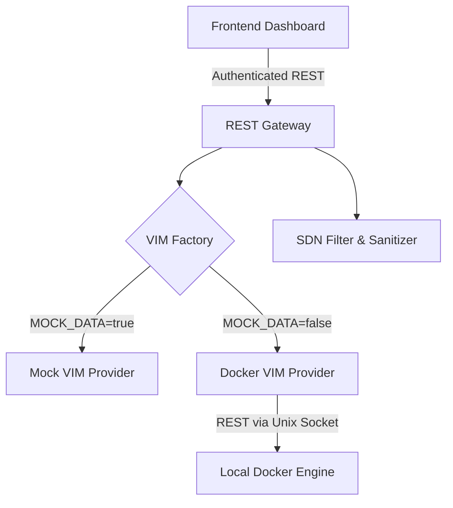

# ⚛️ Atomic Platform: Next-Gen NFV Orchestration

[](.)
[](.)
[](.)
[](https://github.com/Ramius-arch)

> **Precision Control and Real-time Visualization for the Virtualized Network Edge.**

---

## 🎯 The Problem: The Complexity of Modern Networks

Network Function Virtualization (NFV) promises agility, cost savings, and scalability. However, managing a distributed ecosystem of virtualized network functions (VNFs) across hybrid environments (bare-metal, private cloud, public cloud) introduces significant operational complexity. Network operators and engineers often face:

-   **Fragmented Tooling:** Juggling multiple, vendor-specific interfaces for different network functions and hardware.
-   **Lack of Visibility:** Difficulty in visualizing the end-to-end service chains and underlying resource utilization in real-time.
-   **Manual Provisioning:** Slow, error-prone manual processes for deploying, scaling, and updating VNFs.
-   **Integration Challenges:** Bridging modern, API-driven infrastructure with legacy, CLI-based systems.

Without a unified and intelligent orchestration layer, the true benefits of NFV remain locked away, and operational costs can spiral.

---

## ✨ The Solution: Atomic Orchestration

**Atomic** is a high-performance **Network Function Virtualization (NFV) Orchestration Tool** designed to tame this complexity. It provides a single, unified command center for the entire NFV lifecycle, from deployment and monitoring to scaling and maintenance.

By bridging the gap between complex bare-metal infrastructure and agile, cloud-native virtualization, Atomic empowers operators to manage their networks with precision, foresight, and unprecedented efficiency.

---

## 👥 Target Audience

This platform is built for professionals at the intersection of networking, infrastructure, and software:

-   **Network Architects & Operators:** For designing, deploying, and managing resilient and scalable network services.
-   **DevOps & SREs:** For automating the deployment and lifecycle management of VNFs as part of a CI/CD pipeline.
-   **Infrastructure Engineers:** For managing and allocating the underlying physical and virtual resources.
-   **Telecom Engineers:** For transitioning from traditional hardware-centric networks to a modern, virtualized infrastructure.

---

## 🚀 Core Features

### 🛠️ Strategic Orchestration & Lifecycle Management

-   **Centralized Control Plane:** Push silicon-level configurations, manage network policies, and query real-time states from a single interface.
-   **Dynamic Resource Allocation:** Automate the provisioning and scaling of compute, memory, and storage assets. Lease and reclaim physical resources on-demand.
-   **Data Plane Flow-Bridge:** Inject and manage SDN flow-rules across switches with sub-second latency for dynamic traffic engineering.
-   **Legacy System Integration:** Seamlessly bridge modern, API-driven orchestration with legacy CLI-based hardware, protecting existing investments.

### 📊 Tactical Awareness & Real-Time Monitoring

-   **Live Network Topology:** An interactive, graph-based map of the entire network mesh, providing a bird's-eye view of service chains and dependencies.
-   **Unified Telemetry Streams:** Real-time visualization of CPU, Memory, and Network throughput for VNFs and physical hosts.
-   **Predictive Analytics:** (Roadmap Feature) Leverage historical data to anticipate bottlenecks and proactively scale resources.
-   **Collapsible Dashboards:** Information-dense yet clean layouts optimized for operational focus, allowing users to drill down into specific metrics.

### 🧪 Dual-Mode Environment for Safety and Training

-   **Live Production Mode:** Directly manipulate and orchestrate production-grade infrastructure with appropriate safeguards.
-   **"Sandbox" Simulation Mode:** A fully-functional simulation environment using mock data. Perfect for training new operators, testing new service chains, and performing system walkthroughs without impacting the live network.

---

## 🧐 How It Works

Atomic simplifies network orchestration into an intuitive, three-step workflow:

1.  **Define & Deploy:** Use the dashboard to define a new network service, selecting the required VNFs (e.g., firewall, load balancer, WAN optimizer) and specifying the service chain. The Resource Allocator automatically reserves the necessary compute and network resources.
2.  **Monitor & Analyze:** Once deployed, the service appears on the live Network Topology map. Operators can monitor the health and performance of each VNF in real-time via the Telemetry dashboards, tracking CPU, memory, and traffic flows.
3.  **Scale & Adapt:** As traffic demands change, operators can scale VNFs up or down with a single click. The Control Plane automatically adjusts network configurations and flow rules to accommodate the new resource allocation, ensuring seamless service continuity.

---

## 🧬 System Architecture

Atomic uses a modular, decoupled architecture separating the presentation layer from the core orchestration control plane.



### 🛠️ Tech Stack & Security Hardening

| Layer | Technologies | Security Hardening |
| :--- | :--- | :--- |
| **Frontend** | React 19, TypeScript, Tailwind CSS, Vite | Token-auth headers, Error boundary filters |
| **Data Viz** | XYFlow (Topology UX), Chart.js (Telemetry) | Dynamic data polling & local fallback interpolation |
| **Backend** | Node.js, Express, TypeScript | Helmet headers, rate limiting, stateless registry |
| **Automation** | Pluggable VIM (Docker Socket REST) | Parameter whitelists, CLI regex sanitization |
| **Testing** | Jest (Backend), Vitest (Frontend) | Integration and mock contract validation |

---

## 🎨 UI/UX Philosophy: "The Atomic Aesthetic"
The platform features a custom-engineered **Atomic Theme**—a professional-grade, eye-friendly "Midnight" aesthetic designed for long operational shifts. It prioritizes information density while maintaining visual comfort through:
- **Softer Neon Palette**: High-contrast elements shifted to eye-friendly cyan and muted amber.
- **Focus-Aware UX**: Hover effects and active states that provide subtle, clear feedback.
- **Bento Grid Layouts**: Clean, modular structure for complex navigation.

---

## 🏁 Getting Started

### 1. Prerequisites
- Node.js (v18 or later)
- npm

### 2. Installation
```bash
# Clone the repository
git clone https://github.com/Ramius-arch/Network-Function-Virtualization---NFV--Orchestration-Tool.git
cd Network-Function-Virtualization---NFV--Orchestration-Tool

# Install all dependencies for both Frontend and Backend
npm run install-all
```

### 3. Configuration
Create a `.env` file in the `Backend/` directory with the following content:
```env
MOCK_DATA=true          # Use `true` for Sandbox mode, `false` for Live mode
VIM_PROVIDER=mock       # Target infrastructure: `mock` (sandbox simulator) or `docker` (local socket)
JWT_SECRET=your_super_secret_key_here  # Replace with a strong, unique secret
PORT=3000
```

### 4. Launching the Application
```bash
# Start the full stack (Frontend + Backend) concurrently
npm run start-all
```
Your application will be available at `http://localhost:5173` (Frontend) and the backend API will be running on `http://localhost:3000`.

---

## 🗺️ Project Roadmap

-   [ ] **Q1 2026:** Enhanced VNF catalog with support for more third-party network functions.
-   [ ] **Q2 2026:** Implementation of a predictive analytics engine for proactive resource management.
-   [ ] **Q3 2026:** Integration with popular public cloud APIs (AWS, Azure, GCP) for hybrid cloud orchestration.
-   [ ] **Q4 2026:** Advanced security and policy management module.

---

## 🤝 Contributing

We welcome contributions from the community! If you'd like to contribute, please follow these steps:

1.  Fork the repository.
2.  Create a new branch (`git checkout -b feature/YourFeatureName`).
3.  Make your changes.
4.  Commit your changes (`git commit -m 'Add some feature'`).
5.  Push to the branch (`git push origin feature/YourFeatureName`).
6.  Open a Pull Request.

Please make sure to update tests as appropriate.

---

## 👤 Author

**Ramius_arch** - *Lead Architect & Developer*

---

## 📄 License

Atomic is licensed under the [MIT License](LICENSE).
